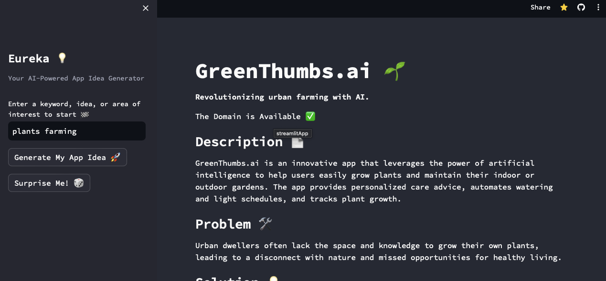

# Eureka 💡 
## Your AI-Powered App Idea Generator 

Eureka is an AI-powered app idea generator that transforms keywords and areas of interest into innovative app concepts. It helps developers kickstart their creative process by providing app names, taglines, descriptions, and key business insights.

### Technologies Used

- Streamlit
- Snowflake-arctic through Replicate API
- Python

This is an official submission to the [THE FUTURE OF AI IS OPEN](https://arctic-streamlit-hackathon.devpost.com/) hackathon on DEVPOST
